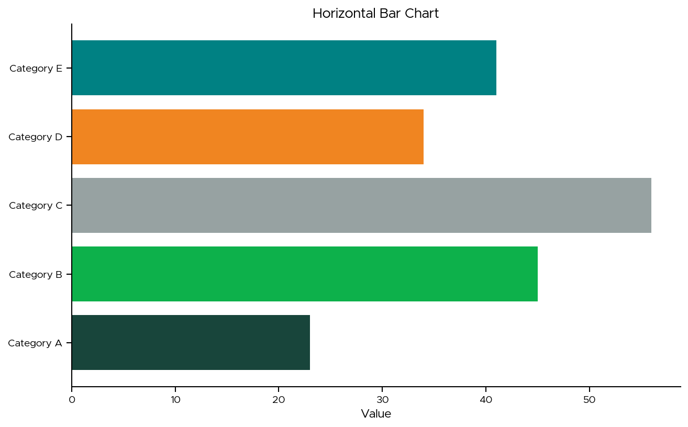
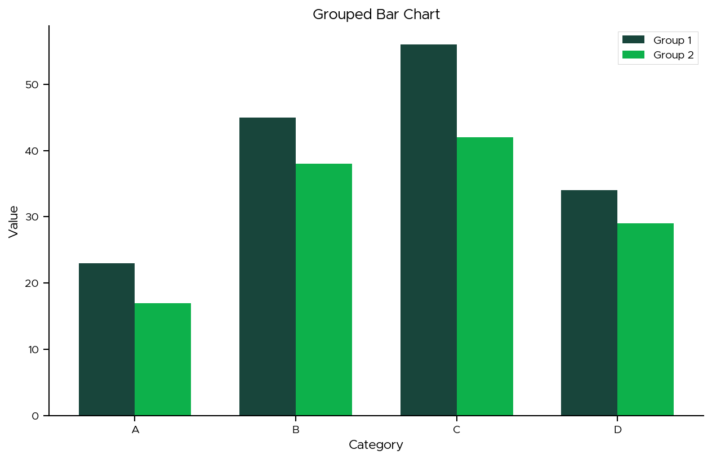
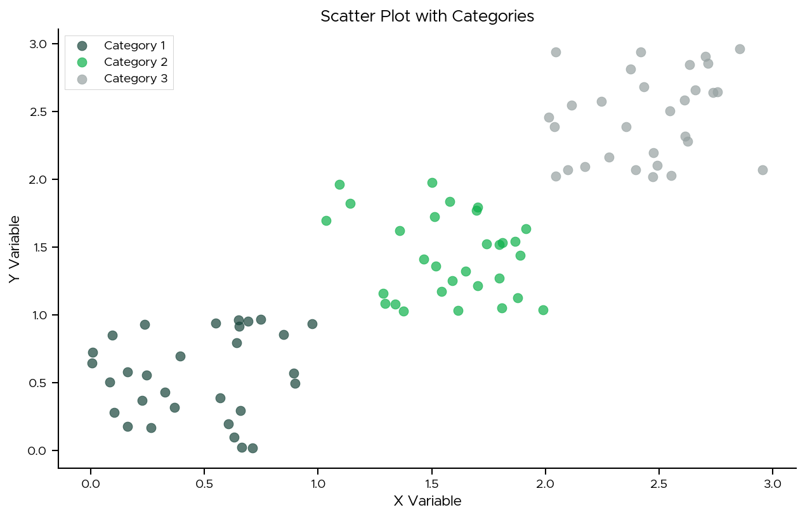
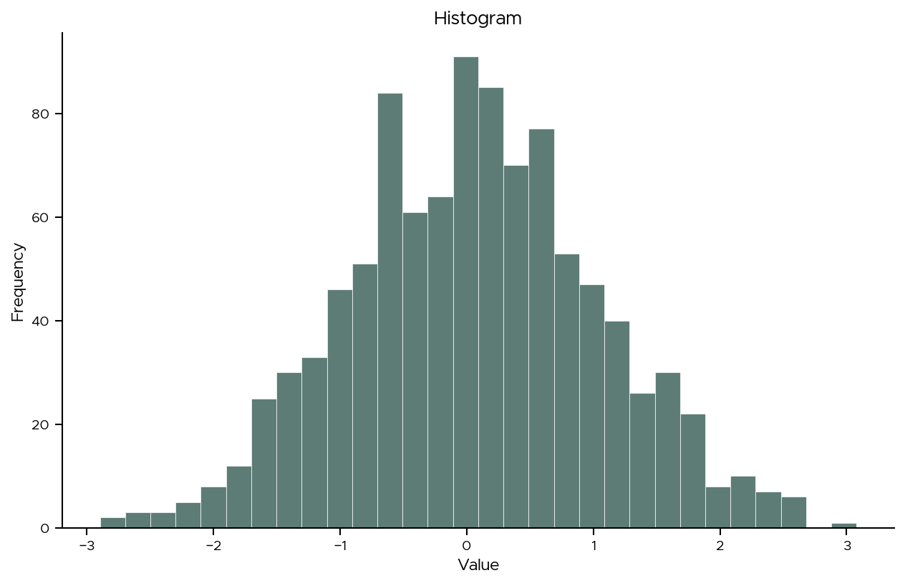
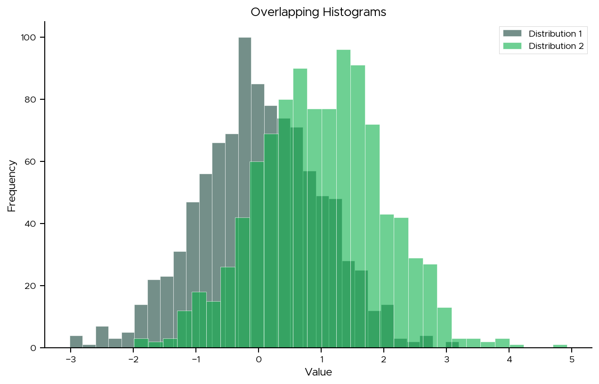
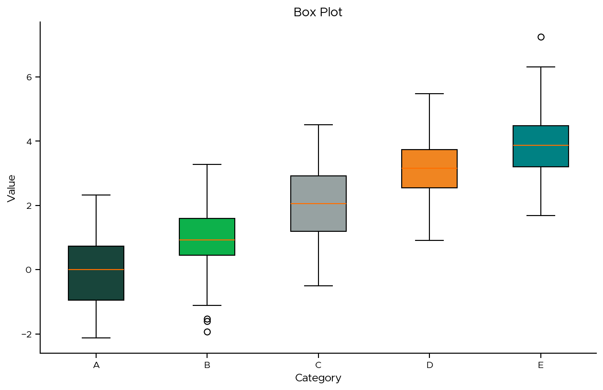
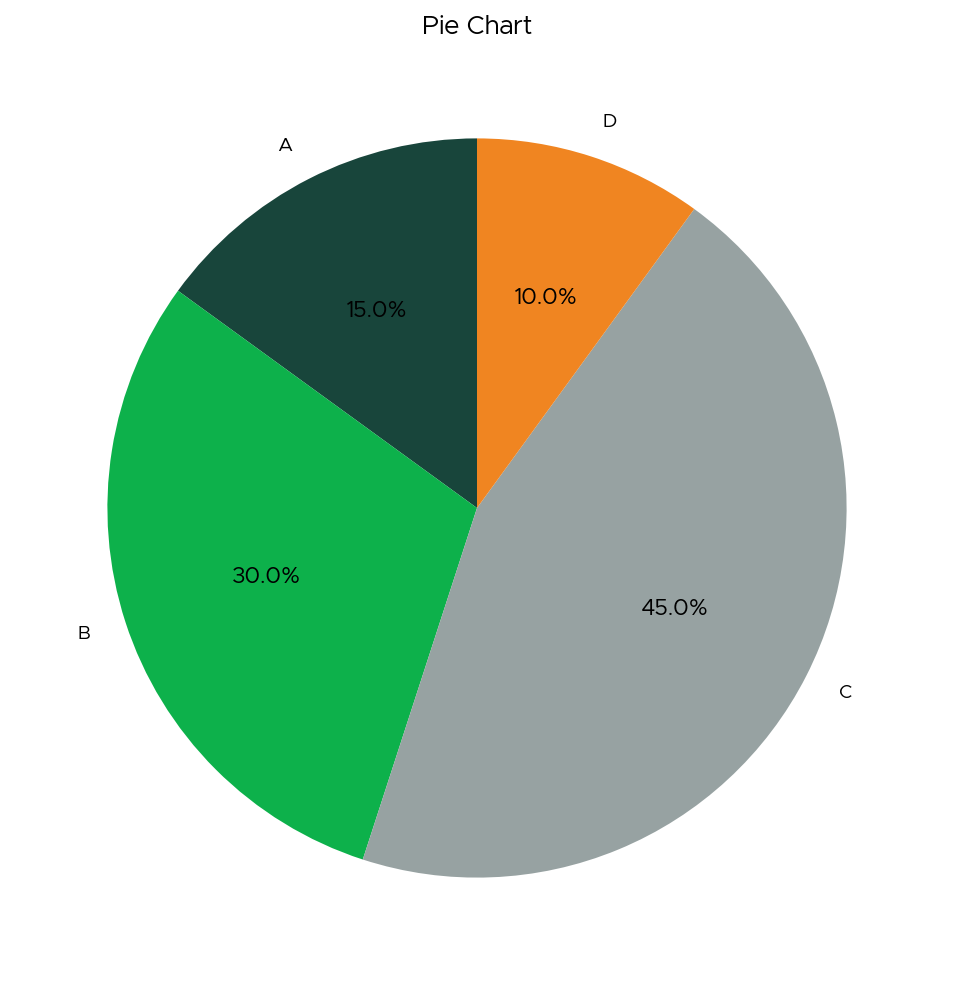
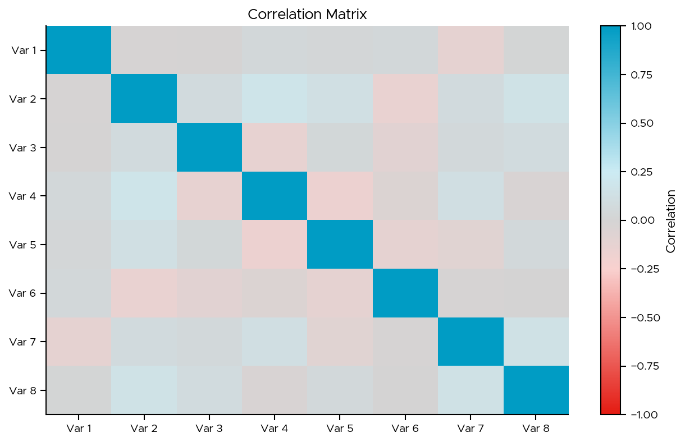
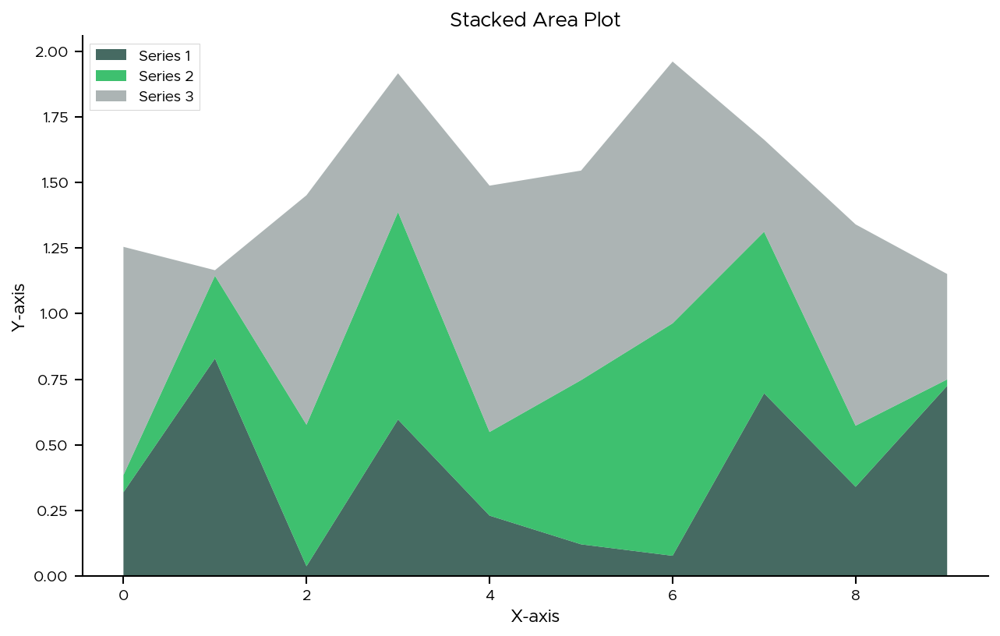

# Basic Plots

This gallery demonstrates basic plotting capabilities with MSUthemes using common chart types.

## Line Plots

### Single Series

```python
from msuthemes import theme_msu, MSU_GREEN
import matplotlib.pyplot as plt
import numpy as np

# Apply MSU theme
theme_msu()

# Create data
x = np.linspace(0, 10, 100)
y = np.sin(x)

# Plot
fig, ax = plt.subplots(figsize=(10, 6))
ax.plot(x, y, color=MSU_GREEN, linewidth=2.5)
ax.set_xlabel('X-axis')
ax.set_ylabel('Y-axis')
ax.set_title('Single Series Line Plot')
plt.tight_layout()
plt.show()
```


### Multiple Series

```python
from msuthemes import theme_msu, msu_qual1
import matplotlib.pyplot as plt
import numpy as np

# Apply MSU theme
theme_msu()

# Create data
x = np.linspace(0, 10, 100)
colors = msu_qual1.as_hex()

# Plot multiple series
fig, ax = plt.subplots(figsize=(10, 6))
for i, color in enumerate(colors[:3]):
    y = np.sin(x + i * 0.5)
    ax.plot(x, y, color=color, linewidth=2.5,
            label=f'Series {i+1}')

ax.set_xlabel('X-axis')
ax.set_ylabel('Y-axis')
ax.set_title('Multiple Series Line Plot')
ax.legend(frameon=False)
plt.tight_layout()
plt.show()
```


## Bar Charts

### Vertical Bars

```python
from msuthemes import theme_msu, msu_qual1
import matplotlib.pyplot as plt

# Apply MSU theme
theme_msu()

# Data
categories = ['A', 'B', 'C', 'D', 'E']
values = [23, 45, 56, 34, 41]

# Plot
fig, ax = plt.subplots(figsize=(10, 6))
ax.bar(categories, values, color=msu_qual1.as_hex())
ax.set_xlabel('Category')
ax.set_ylabel('Value')
ax.set_title('Vertical Bar Chart')
plt.tight_layout()
plt.show()
```


### Horizontal Bars

```python
from msuthemes import theme_msu, msu_qual1
import matplotlib.pyplot as plt

# Apply MSU theme
theme_msu()

# Data
categories = ['Category A', 'Category B', 'Category C',
              'Category D', 'Category E']
values = [23, 45, 56, 34, 41]

# Plot
fig, ax = plt.subplots(figsize=(10, 6))
ax.barh(categories, values, color=msu_qual1.as_hex())
ax.set_xlabel('Value')
ax.set_title('Horizontal Bar Chart')
plt.tight_layout()
plt.show()
```



### Grouped Bars

```python
from msuthemes import theme_msu, msu_qual1
import matplotlib.pyplot as plt
import numpy as np

# Apply MSU theme
theme_msu()

# Data
categories = ['A', 'B', 'C', 'D']
group1 = [23, 45, 56, 34]
group2 = [17, 38, 42, 29]

# Plot
fig, ax = plt.subplots(figsize=(10, 6))
x = np.arange(len(categories))
width = 0.35

colors = msu_qual1.as_hex()
ax.bar(x - width/2, group1, width, label='Group 1',
       color=colors[0])
ax.bar(x + width/2, group2, width, label='Group 2',
       color=colors[1])

ax.set_xlabel('Category')
ax.set_ylabel('Value')
ax.set_title('Grouped Bar Chart')
ax.set_xticks(x)
ax.set_xticklabels(categories)
ax.legend()
plt.tight_layout()
plt.show()
```



## Scatter Plots

### Basic Scatter

```python
from msuthemes import theme_msu, MSU_GREEN
import matplotlib.pyplot as plt
import numpy as np

# Apply MSU theme
theme_msu()

# Data
np.random.seed(42)
x = np.random.rand(100)
y = np.random.rand(100)

# Plot
fig, ax = plt.subplots(figsize=(10, 6))
ax.scatter(x, y, color=MSU_GREEN, s=50, alpha=0.6)
ax.set_xlabel('X Variable')
ax.set_ylabel('Y Variable')
ax.set_title('Scatter Plot')
plt.tight_layout()
plt.show()
```


### Scatter with Categories

```python
from msuthemes import theme_msu, msu_qual1
import matplotlib.pyplot as plt
import numpy as np

# Apply MSU theme
theme_msu()

# Data
np.random.seed(42)
n_per_category = 30
colors = msu_qual1.as_hex()

# Plot
fig, ax = plt.subplots(figsize=(10, 6))

for i, color in enumerate(colors[:3]):
    x = np.random.rand(n_per_category) + i
    y = np.random.rand(n_per_category) + i
    ax.scatter(x, y, color=color, s=50, alpha=0.7,
               label=f'Category {i+1}')

ax.set_xlabel('X Variable')
ax.set_ylabel('Y Variable')
ax.set_title('Scatter Plot with Categories')
ax.legend()
plt.tight_layout()
plt.show()
```



## Histograms

### Basic Histogram

```python
from msuthemes import theme_msu, MSU_GREEN
import matplotlib.pyplot as plt
import numpy as np

# Apply MSU theme
theme_msu()

# Data
np.random.seed(42)
data = np.random.randn(1000)

# Plot
fig, ax = plt.subplots(figsize=(10, 6))
ax.hist(data, bins=30, color=MSU_GREEN, alpha=0.7,
        edgecolor='white')
ax.set_xlabel('Value')
ax.set_ylabel('Frequency')
ax.set_title('Histogram')
plt.tight_layout()
plt.show()
```



### Overlapping Histograms

```python
from msuthemes import theme_msu, msu_qual1
import matplotlib.pyplot as plt
import numpy as np

# Apply MSU theme
theme_msu()

# Data
np.random.seed(42)
data1 = np.random.randn(1000)
data2 = np.random.randn(1000) + 1
colors = msu_qual1.as_hex()

# Plot
fig, ax = plt.subplots(figsize=(10, 6))
ax.hist(data1, bins=30, alpha=0.6, color=colors[0],
        label='Distribution 1', edgecolor='white')
ax.hist(data2, bins=30, alpha=0.6, color=colors[1],
        label='Distribution 2', edgecolor='white')

ax.set_xlabel('Value')
ax.set_ylabel('Frequency')
ax.set_title('Overlapping Histograms')
ax.legend()
plt.tight_layout()
plt.show()
```



## Box Plots

### Basic Box Plot

```python
from msuthemes import theme_msu, msu_qual1
import matplotlib.pyplot as plt
import numpy as np

# Apply MSU theme
theme_msu()

# Data
np.random.seed(42)
data = [np.random.randn(100) + i for i in range(5)]
colors = msu_qual1.as_hex()

# Plot
fig, ax = plt.subplots(figsize=(10, 6))
bp = ax.boxplot(data, patch_artist=True)

# Color boxes
for patch, color in zip(bp['boxes'], colors):
    patch.set_facecolor(color)

ax.set_xlabel('Category')
ax.set_ylabel('Value')
ax.set_title('Box Plot')
ax.set_xticklabels(['A', 'B', 'C', 'D', 'E'])
plt.tight_layout()
plt.show()
```



## Pie Charts

### Basic Pie Chart

```python
from msuthemes import theme_msu, msu_qual1
import matplotlib.pyplot as plt

# Apply MSU theme
theme_msu()

# Data
sizes = [15, 30, 45, 10]
labels = ['A', 'B', 'C', 'D']
colors = msu_qual1.as_hex()[:4]

# Plot
fig, ax = plt.subplots(figsize=(8, 8))
ax.pie(sizes, labels=labels, colors=colors, autopct='%1.1f%%',
       startangle=90)
ax.set_title('Pie Chart')
plt.tight_layout()
plt.show()
```



## Heatmaps

### Basic Heatmap

```python
from msuthemes import theme_msu, msu_seq
import matplotlib.pyplot as plt
import numpy as np

# Apply MSU theme
theme_msu()

# Data
np.random.seed(42)
data = np.random.rand(10, 10)

# Plot
fig, ax = plt.subplots(figsize=(10, 8))
im = ax.imshow(data, cmap=msu_seq.as_matplotlib_cmap(),
               aspect='auto')
ax.set_xlabel('X-axis')
ax.set_ylabel('Y-axis')
ax.set_title('Heatmap')
plt.colorbar(im, ax=ax, label='Value')
plt.tight_layout()
plt.show()
```


### Correlation Matrix

```python
from msuthemes import theme_msu, msu_div
import matplotlib.pyplot as plt
import numpy as np

# Apply MSU theme
theme_msu()

# Create correlation matrix
np.random.seed(42)
n_vars = 8
data = np.random.randn(100, n_vars)
corr_matrix = np.corrcoef(data.T)

# Plot
fig, ax = plt.subplots(figsize=(10, 8))
im = ax.imshow(corr_matrix,
               cmap=msu_div.as_matplotlib_cmap(),
               vmin=-1, vmax=1,
               aspect='auto')

# Labels
var_names = [f'Var {i+1}' for i in range(n_vars)]
ax.set_xticks(np.arange(n_vars))
ax.set_yticks(np.arange(n_vars))
ax.set_xticklabels(var_names)
ax.set_yticklabels(var_names)

ax.set_title('Correlation Matrix')
plt.colorbar(im, ax=ax, label='Correlation')
plt.tight_layout()
plt.show()
```



## Area Plots

### Stacked Area

```python
from msuthemes import theme_msu, msu_qual1
import matplotlib.pyplot as plt
import numpy as np

# Apply MSU theme
theme_msu()

# Data
x = np.arange(10)
y1 = np.random.rand(10)
y2 = np.random.rand(10)
y3 = np.random.rand(10)
colors = msu_qual1.as_hex()

# Plot
fig, ax = plt.subplots(figsize=(10, 6))
ax.stackplot(x, y1, y2, y3, labels=['Series 1', 'Series 2', 'Series 3'],
             colors=colors[:3], alpha=0.8)

ax.set_xlabel('X-axis')
ax.set_ylabel('Y-axis')
ax.set_title('Stacked Area Plot')
ax.legend(loc='upper left')
plt.tight_layout()
plt.show()
```



## Subplots

### Multiple Subplots

```python
from msuthemes import theme_msu, msu_qual1, MSU_GREEN
import matplotlib.pyplot as plt
import numpy as np

# Apply MSU theme
theme_msu()

# Data
x = np.linspace(0, 10, 100)
colors = msu_qual1.as_hex()

# Create subplots
fig, axes = plt.subplots(2, 2, figsize=(12, 10))

# Plot 1: Line
axes[0, 0].plot(x, np.sin(x), color=MSU_GREEN, linewidth=2)
axes[0, 0].set_title('Line Plot')

# Plot 2: Scatter
axes[0, 1].scatter(np.random.rand(50), np.random.rand(50),
                   color=colors[1], s=50, alpha=0.6)
axes[0, 1].set_title('Scatter Plot')

# Plot 3: Bar
axes[1, 0].bar(['A', 'B', 'C', 'D'], [3, 7, 2, 5],
               color=colors[:4])
axes[1, 0].set_title('Bar Chart')

# Plot 4: Histogram
axes[1, 1].hist(np.random.randn(1000), bins=30,
                color=colors[2], alpha=0.7)
axes[1, 1].set_title('Histogram')

plt.tight_layout()
plt.show()
```


## See Also

- [MSU Themes](msu.md) - Advanced MSU-themed visualizations
- [Big Ten](bigten.md) - Comparative Big Ten visualizations
- [User Guide](../guide/themes.md) - Theme customization
