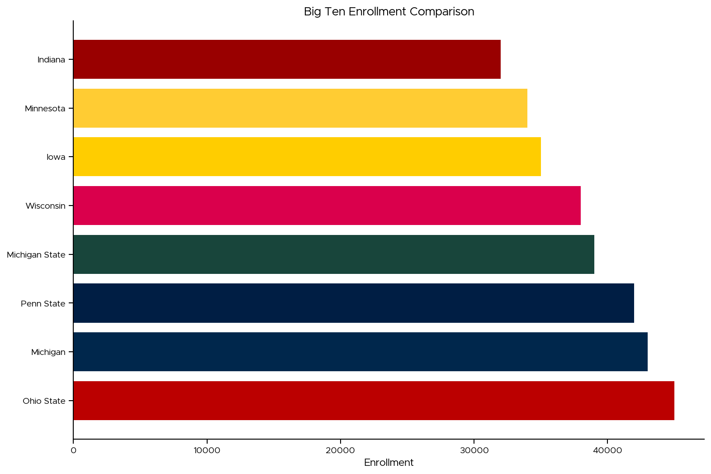
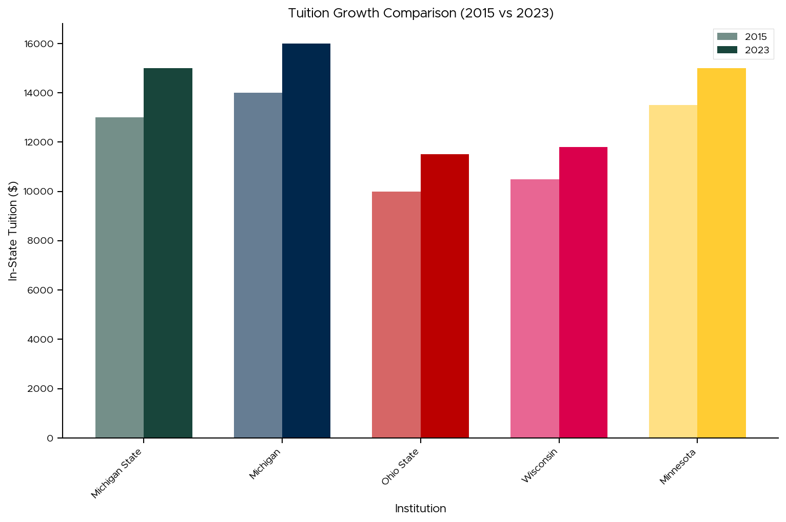
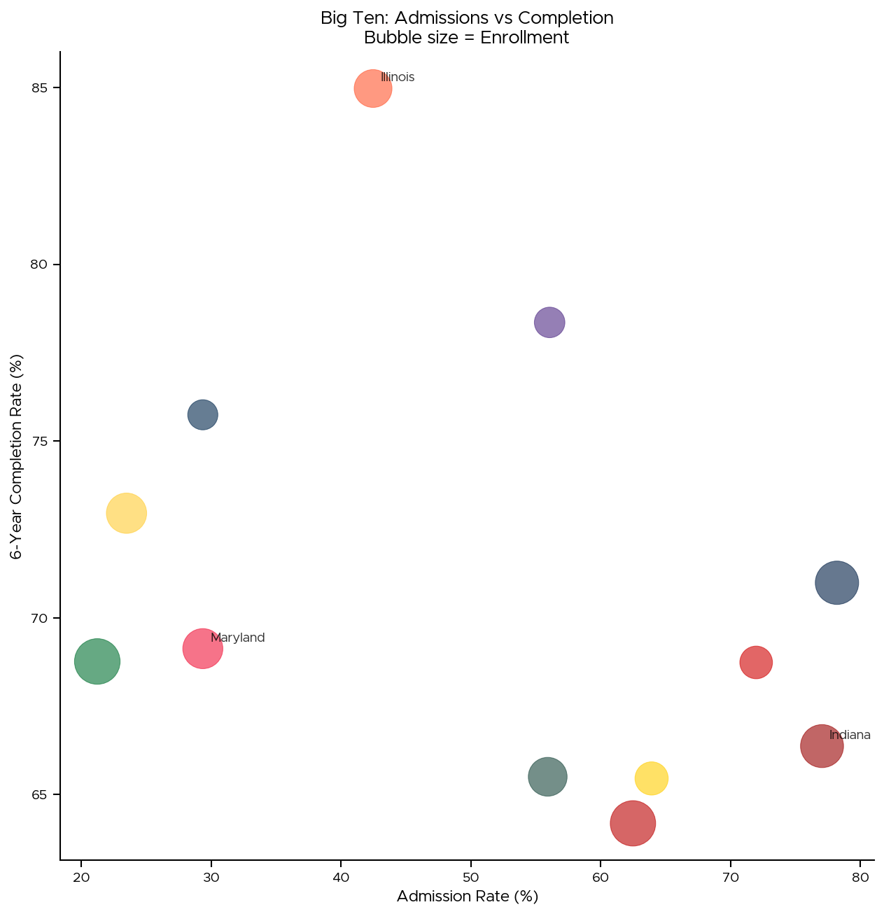
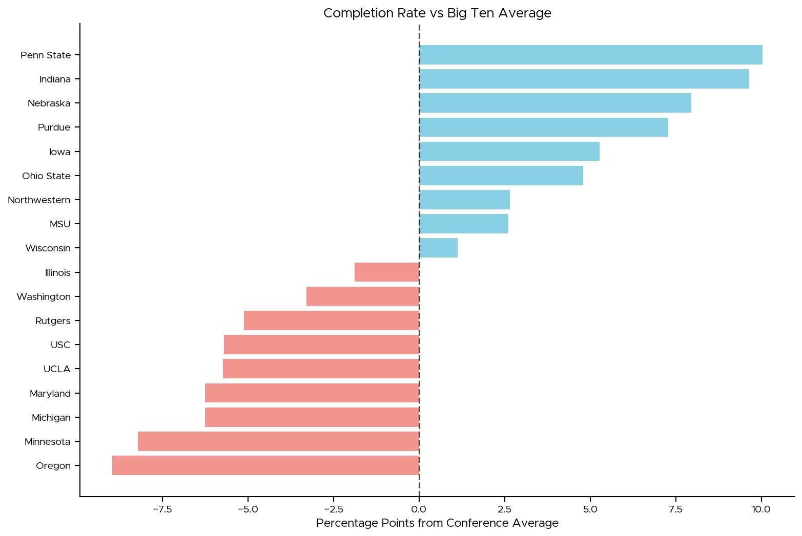
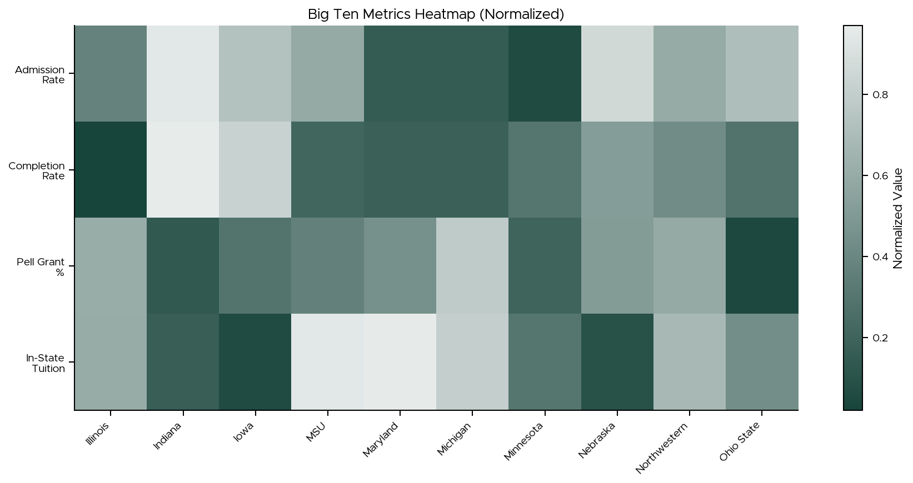
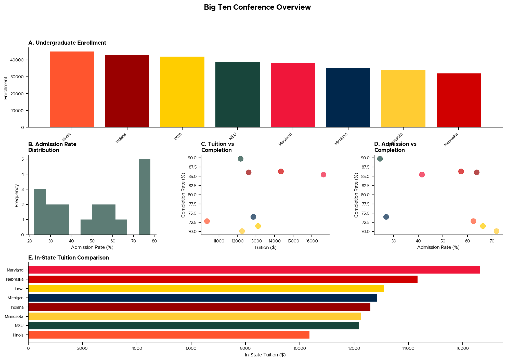

# Big Ten Visualizations

This gallery demonstrates comparative visualizations across Big Ten Conference institutions using MSUthemes.

## Conference Comparisons

### Simple Bar Comparison

```python
from msuthemes import (
    load_bigten_data, bigten_palette,
    list_bigten_institutions, theme_msu
)
import matplotlib.pyplot as plt

# Apply theme
theme_msu()

# Load recent data
df = load_bigten_data(years=[2023],
                     columns=['INSTNM', 'UGDS'])

# Sort by enrollment
df_sorted = df.sort_values('UGDS', ascending=False)

# Get colors for each institution
colors = bigten_palette(df_sorted['INSTNM'].tolist())

# Plot
fig, ax = plt.subplots(figsize=(12, 8))
ax.barh(range(len(df_sorted)), df_sorted['UGDS'],
        color=colors)
ax.set_yticks(range(len(df_sorted)))
ax.set_yticklabels(df_sorted['INSTNM'])
ax.set_xlabel('Undergraduate Enrollment')
ax.set_title('Big Ten Enrollment Comparison (2023)')

plt.tight_layout()
plt.show()
```



### Time Series Comparison

```python
from msuthemes import (
    load_bigten_data, bigten_palette, theme_msu
)
import matplotlib.pyplot as plt

# Apply theme
theme_msu(grid=True)

# Select institutions to compare
schools = ['Michigan State', 'Michigan', 'Ohio State',
           'Wisconsin', 'Penn State']

# Load data
df = load_bigten_data(
    institutions=schools,
    columns=['INSTNM', 'YEAR', 'ADM_RATE']
)

# Filter to recent years
df_recent = df[df['YEAR'] >= 2010]

# Get colors
colors = bigten_palette(schools)

# Plot
fig, ax = plt.subplots(figsize=(12, 7))

for school, color in zip(schools, colors):
    school_data = df_recent[df_recent['INSTNM'] == school]
    ax.plot(school_data['YEAR'],
            school_data['ADM_RATE'] * 100,
            color=color,
            linewidth=2.5,
            marker='o',
            markersize=6,
            label=school)

ax.set_xlabel('Year')
ax.set_ylabel('Admission Rate (%)')
ax.set_title('Big Ten Admission Rates Over Time')
ax.legend(frameon=False, loc='best')

plt.tight_layout()
plt.show()
```


### Grouped Bar Comparison

```python
from msuthemes import (
    load_bigten_data, bigten_palette, theme_msu
)
import matplotlib.pyplot as plt
import numpy as np

# Apply theme
theme_msu()

# Select schools
schools = ['Michigan State', 'Michigan', 'Ohio State',
           'Wisconsin', 'Minnesota']

# Load data for two years
df = load_bigten_data(
    institutions=schools,
    years=[2015, 2023],
    columns=['INSTNM', 'YEAR', 'TUITIONFEE_IN']
)

# Pivot data
df_2015 = df[df['YEAR'] == 2015].set_index('INSTNM')
df_2023 = df[df['YEAR'] == 2023].set_index('INSTNM')

# Get colors
colors = bigten_palette(schools)

# Plot
fig, ax = plt.subplots(figsize=(12, 7))

x = np.arange(len(schools))
width = 0.35

ax.bar(x - width/2, df_2015.loc[schools, 'TUITIONFEE_IN'],
       width, label='2015', color=colors, alpha=0.6)
ax.bar(x + width/2, df_2023.loc[schools, 'TUITIONFEE_IN'],
       width, label='2023', color=colors, alpha=1.0)

ax.set_xlabel('Institution')
ax.set_ylabel('In-State Tuition ($)')
ax.set_title('Tuition Growth Comparison (2015 vs 2023)')
ax.set_xticks(x)
ax.set_xticklabels(schools, rotation=45, ha='right')
ax.legend()

plt.tight_layout()
plt.show()
```



## Multi-Metric Comparisons

### Radar Chart

```python
from msuthemes import (
    load_bigten_data, bigten_palette, theme_msu
)
import matplotlib.pyplot as plt
import numpy as np
from math import pi

# Apply theme
theme_msu()

# Select schools
schools = ['Michigan State', 'Michigan', 'Wisconsin']

# Load multiple metrics (normalized example)
# Note: This uses fictional normalized data for demonstration
metrics = ['Admission\nRate', 'Completion\nRate',
           'Diversity', 'Research', 'Athletics']
n_metrics = len(metrics)

# Create data (normalized 0-100 scale)
data = {
    'Michigan State': [75, 82, 70, 85, 90],
    'Michigan': [78, 85, 68, 92, 88],
    'Wisconsin': [72, 80, 65, 88, 85]
}

# Get colors
colors = bigten_palette(schools)

# Compute angle for each axis
angles = [n / float(n_metrics) * 2 * pi for n in range(n_metrics)]
angles += angles[:1]

# Plot
fig, ax = plt.subplots(figsize=(10, 10),
                       subplot_kw=dict(projection='polar'))

for school, color in zip(schools, colors):
    values = data[school]
    values += values[:1]
    ax.plot(angles, values, 'o-', linewidth=2,
            color=color, label=school)
    ax.fill(angles, values, alpha=0.15, color=color)

ax.set_xticks(angles[:-1])
ax.set_xticklabels(metrics)
ax.set_ylim(0, 100)
ax.set_title('Multi-Dimensional Comparison', pad=20)
ax.legend(loc='upper right', bbox_to_anchor=(1.3, 1.1),
          frameon=False)
ax.grid(True)

plt.tight_layout()
plt.show()
```

### Scatter Matrix Comparison

```python
from msuthemes import (
    load_bigten_data, bigten_palette,
    list_bigten_institutions, theme_msu
)
import matplotlib.pyplot as plt

# Apply theme
theme_msu()

# Load data
df = load_bigten_data(
    years=[2023],
    columns=['INSTNM', 'ADM_RATE', 'C150_4',
             'UGDS', 'TUITIONFEE_IN']
)

# Get all institutions and colors
institutions = df['INSTNM'].tolist()
colors = bigten_palette(institutions)

# Create color map
color_map = dict(zip(institutions, colors))
point_colors = [color_map[inst] for inst in df['INSTNM']]

# Plot
fig, ax = plt.subplots(figsize=(10, 10))

scatter = ax.scatter(df['ADM_RATE'] * 100,
                     df['C150_4'] * 100,
                     s=df['UGDS'] / 50,
                     c=point_colors,
                     alpha=0.6)

ax.set_xlabel('Admission Rate (%)')
ax.set_ylabel('6-Year Completion Rate (%)')
ax.set_title('Big Ten: Admissions vs Completion (2023)\nBubble size = Enrollment')

# Add labels for interesting points
for idx, row in df.iterrows():
    if row['ADM_RATE'] < 0.25 or row['C150_4'] > 0.90:
        ax.annotate(row['INSTNM'],
                   (row['ADM_RATE'] * 100, row['C150_4'] * 100),
                   xytext=(5, 5),
                   textcoords='offset points',
                   fontsize=9,
                   alpha=0.8)

plt.tight_layout()
plt.show()
```



## Diverging Comparisons

### Difference from Conference Average

```python
from msuthemes import (
    load_bigten_data, msu_div, theme_msu
)
import matplotlib.pyplot as plt
import numpy as np

# Apply theme
theme_msu()

# Load data
df = load_bigten_data(
    years=[2023],
    columns=['INSTNM', 'C150_4']
)

# Calculate difference from mean
mean_rate = df['C150_4'].mean()
df['diff'] = (df['C150_4'] - mean_rate) * 100

# Sort
df_sorted = df.sort_values('diff')

# Create color array based on positive/negative
colors = msu_div.as_hex()
color_array = [colors[2] if x < 0 else colors[-3]
               for x in df_sorted['diff']]

# Plot
fig, ax = plt.subplots(figsize=(12, 8))

y_pos = np.arange(len(df_sorted))
ax.barh(y_pos, df_sorted['diff'], color=color_array)

# Add reference line
ax.axvline(x=0, color='black', linestyle='--',
           linewidth=1.5, alpha=0.7)

ax.set_yticks(y_pos)
ax.set_yticklabels(df_sorted['INSTNM'])
ax.set_xlabel('Percentage Points from Conference Average')
ax.set_title('Completion Rate vs Big Ten Average (2023)')

plt.tight_layout()
plt.show()
```



### Change Over Time

```python
from msuthemes import (
    load_bigten_data, bigten_palette, theme_msu
)
import matplotlib.pyplot as plt

# Apply theme
theme_msu()

# Load data
df = load_bigten_data(
    years=[2010, 2023],
    columns=['INSTNM', 'YEAR', 'TUITIONFEE_IN']
)

# Calculate change
df_pivot = df.pivot(index='INSTNM',
                    columns='YEAR',
                    values='TUITIONFEE_IN')
df_pivot['change'] = df_pivot[2023] - df_pivot[2010]
df_pivot['pct_change'] = (df_pivot['change'] / df_pivot[2010]) * 100

# Sort by percent change
df_sorted = df_pivot.sort_values('pct_change', ascending=False)

# Get colors
colors = bigten_palette(df_sorted.index.tolist())

# Plot
fig, ax = plt.subplots(figsize=(12, 8))

y_pos = range(len(df_sorted))
ax.barh(y_pos, df_sorted['pct_change'], color=colors)

ax.set_yticks(y_pos)
ax.set_yticklabels(df_sorted.index)
ax.set_xlabel('Percent Increase (%)')
ax.set_title('In-State Tuition Growth (2010-2023)')

# Add value labels
for i, (idx, row) in enumerate(df_sorted.iterrows()):
    ax.text(row['pct_change'] + 1, i,
            f"+{row['pct_change']:.1f}%",
            va='center', fontsize=9)

plt.tight_layout()
plt.show()
```

## Division Comparisons

### East vs West Division

```python
from msuthemes import (
    load_bigten_data, MSU_GREEN, MSU_ORANGE, theme_msu
)
import matplotlib.pyplot as plt

# Apply theme
theme_msu()

# Define divisions (pre-2024 alignment)
east = ['Illinois', 'Indiana', 'Maryland', 'Michigan',
        'Michigan State', 'Ohio State', 'Penn State',
        'Rutgers', 'Northwestern']
west = ['Iowa', 'Minnesota', 'Nebraska', 'Purdue',
        'Wisconsin']

# Load data
df = load_bigten_data(
    years=[2023],
    columns=['INSTNM', 'ADM_RATE']
)

# Add division
df['Division'] = df['INSTNM'].apply(
    lambda x: 'East' if x in east else 'West'
)

# Calculate means
division_means = df.groupby('Division')['ADM_RATE'].mean()

# Plot
fig, (ax1, ax2) = plt.subplots(1, 2, figsize=(14, 6))

# Box plot
east_data = df[df['Division'] == 'East']['ADM_RATE'] * 100
west_data = df[df['Division'] == 'West']['ADM_RATE'] * 100

bp = ax1.boxplot([east_data, west_data],
                 labels=['East', 'West'],
                 patch_artist=True)

bp['boxes'][0].set_facecolor(MSU_GREEN)
bp['boxes'][1].set_facecolor(MSU_ORANGE)

ax1.set_ylabel('Admission Rate (%)')
ax1.set_title('Admission Rate Distribution by Division')

# Bar comparison
ax2.bar(['East', 'West'],
        division_means * 100,
        color=[MSU_GREEN, MSU_ORANGE])
ax2.set_ylabel('Mean Admission Rate (%)')
ax2.set_title('Average Admission Rate by Division')

plt.tight_layout()
plt.show()
```

## Heatmaps and Matrices

### Conference Heatmap

```python
from msuthemes import (
    load_bigten_data, msu_seq, theme_msu
)
import matplotlib.pyplot as plt
import pandas as pd

# Apply theme
theme_msu()

# Load multiple metrics
df = load_bigten_data(
    years=[2023],
    columns=['INSTNM', 'ADM_RATE', 'C150_4',
             'PCTPELL', 'TUITIONFEE_IN']
)

# Normalize data (0-1 scale)
df_norm = df.copy()
for col in ['ADM_RATE', 'C150_4', 'PCTPELL', 'TUITIONFEE_IN']:
    df_norm[col] = (df_norm[col] - df_norm[col].min()) / \
                   (df_norm[col].max() - df_norm[col].min())

# Pivot for heatmap
df_pivot = df_norm.set_index('INSTNM')[
    ['ADM_RATE', 'C150_4', 'PCTPELL', 'TUITIONFEE_IN']
].T

# Plot
fig, ax = plt.subplots(figsize=(14, 6))

im = ax.imshow(df_pivot.values,
               cmap=msu_seq.as_matplotlib_cmap(),
               aspect='auto')

# Set ticks
ax.set_xticks(range(len(df_pivot.columns)))
ax.set_xticklabels(df_pivot.columns, rotation=45, ha='right')
ax.set_yticks(range(len(df_pivot.index)))
ax.set_yticklabels(['Admission\nRate', 'Completion\nRate',
                    'Pell Grant\n%', 'In-State\nTuition'])

ax.set_title('Big Ten Metrics Heatmap (Normalized, 2023)')
plt.colorbar(im, ax=ax, label='Normalized Value')

plt.tight_layout()
plt.show()
```



### Correlation Between Institutions

```python
from msuthemes import (
    load_bigten_data, msu_div, theme_msu
)
import matplotlib.pyplot as plt
import pandas as pd

# Apply theme
theme_msu()

# Load time series data
df = load_bigten_data(
    years=list(range(2010, 2024)),
    columns=['INSTNM', 'YEAR', 'UGDS']
)

# Pivot to wide format
df_pivot = df.pivot(index='YEAR',
                    columns='INSTNM',
                    values='UGDS')

# Calculate correlation
corr_matrix = df_pivot.corr()

# Plot
fig, ax = plt.subplots(figsize=(12, 10))

im = ax.imshow(corr_matrix,
               cmap=msu_div.as_matplotlib_cmap(),
               vmin=-1, vmax=1,
               aspect='auto')

# Set ticks
ax.set_xticks(range(len(corr_matrix.columns)))
ax.set_yticks(range(len(corr_matrix.index)))
ax.set_xticklabels(corr_matrix.columns, rotation=45, ha='right')
ax.set_yticklabels(corr_matrix.index)

ax.set_title('Enrollment Correlation Between Institutions (2010-2023)')
plt.colorbar(im, ax=ax, label='Correlation Coefficient')

plt.tight_layout()
plt.show()
```

## Complex Multi-Panel Figures

### Conference Overview Dashboard

```python
from msuthemes import (
    load_bigten_data, bigten_palette,
    list_bigten_institutions, theme_msu, MSU_GREEN
)
import matplotlib.pyplot as plt
import numpy as np

# Apply theme
theme_msu(base_size=9)

# Load data
df = load_bigten_data(
    years=[2023],
    columns=['INSTNM', 'UGDS', 'ADM_RATE',
             'C150_4', 'TUITIONFEE_IN']
)

institutions = df['INSTNM'].tolist()
colors = bigten_palette(institutions)

# Create figure
fig = plt.figure(figsize=(16, 10))
gs = fig.add_gridspec(3, 3, hspace=0.35, wspace=0.35)

# Panel 1: Enrollment
ax1 = fig.add_subplot(gs[0, :])
df_sorted = df.sort_values('UGDS', ascending=False)
colors_sorted = bigten_palette(df_sorted['INSTNM'].tolist())
ax1.bar(range(len(df_sorted)), df_sorted['UGDS'],
        color=colors_sorted)
ax1.set_xticks(range(len(df_sorted)))
ax1.set_xticklabels(df_sorted['INSTNM'], rotation=45, ha='right')
ax1.set_ylabel('Enrollment')
ax1.set_title('A. Undergraduate Enrollment', loc='left',
              fontweight='bold')

# Panel 2: Admission Rate Histogram
ax2 = fig.add_subplot(gs[1, 0])
ax2.hist(df['ADM_RATE'] * 100, bins=10,
         color=MSU_GREEN, alpha=0.7)
ax2.set_xlabel('Admission Rate (%)')
ax2.set_ylabel('Frequency')
ax2.set_title('B. Admission Rate\nDistribution',
              loc='left', fontweight='bold')

# Panel 3: Completion Rate vs Tuition
ax3 = fig.add_subplot(gs[1, 1])
ax3.scatter(df['TUITIONFEE_IN'], df['C150_4'] * 100,
           c=colors, s=100, alpha=0.7)
ax3.set_xlabel('Tuition ($)')
ax3.set_ylabel('Completion Rate (%)')
ax3.set_title('C. Tuition vs\nCompletion',
              loc='left', fontweight='bold')

# Panel 4: Admission vs Completion
ax4 = fig.add_subplot(gs[1, 2])
ax4.scatter(df['ADM_RATE'] * 100, df['C150_4'] * 100,
           c=colors, s=100, alpha=0.7)
ax4.set_xlabel('Admission Rate (%)')
ax4.set_ylabel('Completion Rate (%)')
ax4.set_title('D. Admission vs\nCompletion',
              loc='left', fontweight='bold')

# Panel 5: Tuition comparison
ax5 = fig.add_subplot(gs[2, :])
df_tuition = df.sort_values('TUITIONFEE_IN')
colors_tuition = bigten_palette(df_tuition['INSTNM'].tolist())
ax5.barh(range(len(df_tuition)), df_tuition['TUITIONFEE_IN'],
        color=colors_tuition)
ax5.set_yticks(range(len(df_tuition)))
ax5.set_yticklabels(df_tuition['INSTNM'])
ax5.set_xlabel('In-State Tuition ($)')
ax5.set_title('E. In-State Tuition Comparison', loc='left',
              fontweight='bold')

fig.suptitle('Big Ten Conference Overview (2023)',
             fontsize=14, fontweight='bold', y=0.995)

plt.show()
```



## See Also

- [Basic Plots](basic.md) - Fundamental chart types
- [MSU Themes](msu.md) - MSU-specific visualizations
- [Big Ten Guide](../guide/bigten.md) - Big Ten colors and data
- [Datasets Guide](../guide/datasets.md) - Working with Big Ten data
