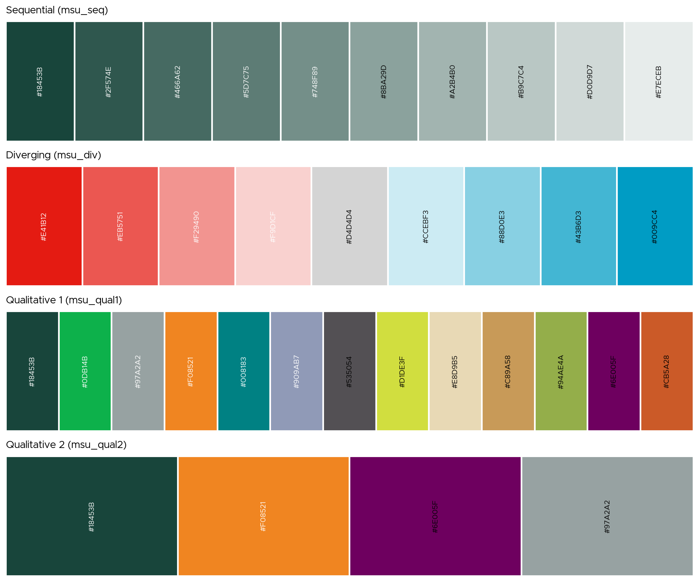
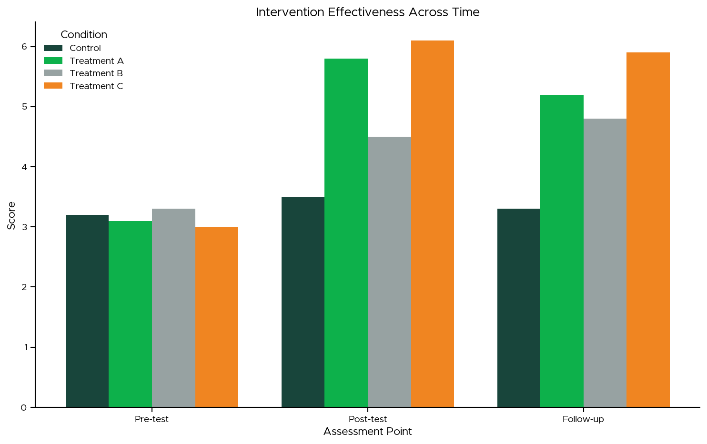

# MSU Themed Visualizations

This gallery showcases advanced visualizations specifically designed with Michigan State University branding and themes.

## Publication-Quality Figures

### Professional Line Chart

```python
from msuthemes import theme_msu, msu_qual1
import matplotlib.pyplot as plt
import numpy as np

# Apply MSU theme with customization
theme_msu(base_size=11, grid=True, spines='bl')

# Data
x = np.linspace(0, 10, 100)
colors = msu_qual1.as_hex()

# Create figure
fig, ax = plt.subplots(figsize=(10, 6))

# Plot multiple series
for i, color in enumerate(colors[:3]):
    y = np.exp(-x/5) * np.sin(x + i * 0.5) + i * 0.5
    ax.plot(x, y, color=color, linewidth=2.5,
            label=f'Treatment {i+1}', marker='o',
            markersize=4, markevery=10)

# Styling
ax.set_xlabel('Time (hours)')
ax.set_ylabel('Response (units)')
ax.set_title('Treatment Response Over Time')
ax.legend(frameon=False, loc='best')
ax.set_xlim(0, 10)

plt.tight_layout()
plt.show()
```


### Research Poster Figure

```python
from msuthemes import theme_msu, msu_qual1
import matplotlib.pyplot as plt
import numpy as np

# Large text for poster presentation
theme_msu(base_size=14, grid=True)

# Data
categories = ['Control', 'Treatment A', 'Treatment B',
              'Treatment C', 'Treatment D']
means = [3.2, 5.8, 4.5, 6.1, 5.3]
std = [0.5, 0.7, 0.6, 0.8, 0.6]

colors = msu_qual1.as_hex()

# Create figure
fig, ax = plt.subplots(figsize=(12, 8))

# Bar plot with error bars
x_pos = np.arange(len(categories))
ax.bar(x_pos, means, yerr=std, color=colors,
       capsize=10, error_kw={'linewidth': 2})

# Styling
ax.set_xticks(x_pos)
ax.set_xticklabels(categories, rotation=0)
ax.set_ylabel('Effect Size (units)')
ax.set_title('Experimental Results Summary', pad=20)

# Add significance markers
ax.plot([1, 3], [7.0, 7.0], 'k-', linewidth=2)
ax.text(2, 7.2, '***', ha='center', fontsize=18)

plt.tight_layout()
plt.show()
```


## MSU Color Demonstrations

### Color Palette Showcase

```python
from msuthemes import (
    theme_msu, msu_seq, msu_div, msu_qual1, msu_qual2
)
import matplotlib.pyplot as plt
import numpy as np

# Apply theme
theme_msu()

# Create figure
fig, axes = plt.subplots(4, 1, figsize=(12, 10))

palettes = [
    ('Sequential (msu_seq)', msu_seq),
    ('Diverging (msu_div)', msu_div),
    ('Qualitative 1 (msu_qual1)', msu_qual1),
    ('Qualitative 2 (msu_qual2)', msu_qual2)
]

for ax, (title, palette) in zip(axes, palettes):
    colors = palette.as_hex()
    n_colors = len(colors)

    # Show color swatches
    for i, color in enumerate(colors):
        ax.add_patch(plt.Rectangle((i, 0), 1, 1,
                                   facecolor=color,
                                   edgecolor='white',
                                   linewidth=2))
        # Add hex code
        ax.text(i + 0.5, 0.5, color,
                ha='center', va='center',
                fontsize=9, rotation=90,
                color='white' if i < n_colors // 2 else 'black')

    ax.set_xlim(0, n_colors)
    ax.set_ylim(0, 1)
    ax.set_title(title, loc='left', pad=10)
    ax.axis('off')

plt.tight_layout()
plt.show()
```



### Gradient Visualization

```python
from msuthemes import theme_msu, msu_seq
import matplotlib.pyplot as plt
import numpy as np

# Apply theme
theme_msu()

# Create gradient data
x = np.linspace(0, 1, 100)
y = np.linspace(0, 1, 100)
X, Y = np.meshgrid(x, y)
Z = np.sqrt(X**2 + Y**2)

# Plot
fig, ax = plt.subplots(figsize=(10, 8))
im = ax.imshow(Z, extent=[0, 1, 0, 1],
               origin='lower',
               cmap=msu_seq.as_matplotlib_cmap(),
               aspect='auto')

ax.set_xlabel('X Coordinate')
ax.set_ylabel('Y Coordinate')
ax.set_title('Sequential Palette Gradient')

cbar = plt.colorbar(im, ax=ax)
cbar.set_label('Distance from Origin')

plt.tight_layout()
plt.show()
```


## Data Visualization Examples

### Time Series with Confidence Intervals

```python
from msuthemes import theme_msu, MSU_GREEN, MSU_ORANGE
import matplotlib.pyplot as plt
import numpy as np

# Apply theme
theme_msu(grid=True)

# Generate data
np.random.seed(42)
x = np.linspace(0, 10, 50)
y1 = np.sin(x) + np.random.randn(50) * 0.2
y2 = np.cos(x) + np.random.randn(50) * 0.2

# Calculate confidence intervals
window = 5
y1_smooth = np.convolve(y1, np.ones(window)/window, mode='same')
y2_smooth = np.convolve(y2, np.ones(window)/window, mode='same')
y1_std = np.std([y1[max(0, i-window):min(len(y1), i+window)]
                 for i in range(len(y1))], axis=1)
y2_std = np.std([y2[max(0, i-window):min(len(y2), i+window)]
                 for i in range(len(y2))], axis=1)

# Plot
fig, ax = plt.subplots(figsize=(12, 6))

# Group 1
ax.plot(x, y1_smooth, color=MSU_GREEN, linewidth=2.5,
        label='Group 1')
ax.fill_between(x, y1_smooth - y1_std, y1_smooth + y1_std,
                 color=MSU_GREEN, alpha=0.2)

# Group 2
ax.plot(x, y2_smooth, color=MSU_ORANGE, linewidth=2.5,
        label='Group 2')
ax.fill_between(x, y2_smooth - y2_std, y2_smooth + y2_std,
                 color=MSU_ORANGE, alpha=0.2)

ax.set_xlabel('Time (days)')
ax.set_ylabel('Measurement')
ax.set_title('Longitudinal Study Results')
ax.legend(frameon=False)

plt.tight_layout()
plt.show()
```


### Grouped Comparison

```python
from msuthemes import theme_msu, msu_qual1
import matplotlib.pyplot as plt
import numpy as np

# Apply theme
theme_msu()

# Data
groups = ['Pre-test', 'Post-test', 'Follow-up']
conditions = ['Control', 'Treatment A', 'Treatment B',
              'Treatment C']

np.random.seed(42)
data = {
    'Control': [3.2, 3.5, 3.3],
    'Treatment A': [3.1, 5.8, 5.2],
    'Treatment B': [3.3, 4.5, 4.8],
    'Treatment C': [3.0, 6.1, 5.9]
}

colors = msu_qual1.as_hex()

# Plot
fig, ax = plt.subplots(figsize=(12, 7))

x = np.arange(len(groups))
width = 0.2

for i, (condition, values) in enumerate(data.items()):
    offset = (i - len(conditions)/2 + 0.5) * width
    ax.bar(x + offset, values, width,
           label=condition, color=colors[i])

ax.set_xlabel('Assessment Point')
ax.set_ylabel('Score')
ax.set_title('Intervention Effectiveness Across Time')
ax.set_xticks(x)
ax.set_xticklabels(groups)
ax.legend(title='Condition', frameon=False)

plt.tight_layout()
plt.show()
```



### Distribution Comparison

```python
from msuthemes import theme_msu, msu_qual1
import matplotlib.pyplot as plt
import numpy as np

# Apply theme
theme_msu()

# Generate data
np.random.seed(42)
data = [
    np.random.normal(100, 15, 500),
    np.random.normal(110, 12, 500),
    np.random.normal(95, 18, 500),
    np.random.normal(105, 10, 500)
]

labels = ['Group A', 'Group B', 'Group C', 'Group D']
colors = msu_qual1.as_hex()

# Create violin plot
fig, ax = plt.subplots(figsize=(12, 7))

parts = ax.violinplot(data, positions=range(len(data)),
                      showmeans=True, showmedians=True)

# Color violins
for i, pc in enumerate(parts['bodies']):
    pc.set_facecolor(colors[i])
    pc.set_alpha(0.7)

ax.set_xticks(range(len(labels)))
ax.set_xticklabels(labels)
ax.set_ylabel('Test Score')
ax.set_title('Score Distribution by Group')

# Add legend
from matplotlib.patches import Patch
legend_elements = [Patch(facecolor=colors[i], alpha=0.7,
                        label=labels[i])
                  for i in range(len(labels))]
ax.legend(handles=legend_elements, frameon=False)

plt.tight_layout()
plt.show()
```

## Complex Layouts

### Dashboard Style

```python
from msuthemes import theme_msu, msu_qual1, MSU_GREEN
import matplotlib.pyplot as plt
import numpy as np

# Apply theme
theme_msu(base_size=10)

# Create complex layout
fig = plt.figure(figsize=(14, 10))
gs = fig.add_gridspec(3, 3, hspace=0.3, wspace=0.3)

colors = msu_qual1.as_hex()

# Top: Large time series
ax1 = fig.add_subplot(gs[0, :])
x = np.linspace(0, 10, 100)
for i in range(3):
    y = np.sin(x + i * 0.5) + i * 0.3
    ax1.plot(x, y, color=colors[i], linewidth=2,
             label=f'Metric {i+1}')
ax1.set_title('Primary Metrics Over Time', loc='left', fontweight='bold')
ax1.legend(ncol=3, frameon=False)
ax1.set_xlabel('Time')

# Middle left: Bar chart
ax2 = fig.add_subplot(gs[1, 0])
categories = ['A', 'B', 'C', 'D']
values = [23, 45, 32, 38]
ax2.bar(categories, values, color=colors[:4])
ax2.set_title('Category Breakdown', loc='left')

# Middle center: Pie chart
ax3 = fig.add_subplot(gs[1, 1])
sizes = [30, 25, 25, 20]
ax3.pie(sizes, labels=categories, colors=colors[:4],
        autopct='%1.0f%%', startangle=90)
ax3.set_title('Proportion Analysis', loc='left')

# Middle right: Scatter
ax4 = fig.add_subplot(gs[1, 2])
x_scatter = np.random.rand(50)
y_scatter = np.random.rand(50)
ax4.scatter(x_scatter, y_scatter, color=MSU_GREEN,
            s=50, alpha=0.6)
ax4.set_title('Correlation View', loc='left')

# Bottom: Histogram
ax5 = fig.add_subplot(gs[2, :])
data = np.random.randn(1000)
ax5.hist(data, bins=50, color=MSU_GREEN, alpha=0.7)
ax5.set_title('Distribution Analysis', loc='left', fontweight='bold')
ax5.set_xlabel('Value')
ax5.set_ylabel('Frequency')

fig.suptitle('MSU Data Dashboard', fontsize=16,
             fontweight='bold', y=0.995)

plt.show()
```


### Multi-Panel Scientific Figure

```python
from msuthemes import theme_msu, msu_seq, MSU_GREEN, MSU_ORANGE
import matplotlib.pyplot as plt
import numpy as np

# Apply theme
theme_msu(base_size=10, grid=True)

# Create figure
fig, axes = plt.subplots(2, 3, figsize=(15, 10))

# Panel A: Line plot
x = np.linspace(0, 10, 100)
axes[0, 0].plot(x, np.sin(x), color=MSU_GREEN, linewidth=2)
axes[0, 0].plot(x, np.cos(x), color=MSU_ORANGE, linewidth=2)
axes[0, 0].set_title('A. Temporal Dynamics')
axes[0, 0].set_xlabel('Time')
axes[0, 0].set_ylabel('Amplitude')

# Panel B: Scatter with regression
np.random.seed(42)
x_data = np.random.rand(50) * 10
y_data = 2 * x_data + np.random.randn(50) * 2
axes[0, 1].scatter(x_data, y_data, color=MSU_GREEN,
                   s=50, alpha=0.6)
z = np.polyfit(x_data, y_data, 1)
p = np.poly1d(z)
axes[0, 1].plot(x_data, p(x_data), 'k--', linewidth=2)
axes[0, 1].set_title('B. Correlation Analysis')
axes[0, 1].set_xlabel('Variable X')
axes[0, 1].set_ylabel('Variable Y')

# Panel C: Heatmap
data = np.random.rand(10, 10)
im = axes[0, 2].imshow(data, cmap=msu_seq.as_matplotlib_cmap(),
                       aspect='auto')
axes[0, 2].set_title('C. Intensity Map')
plt.colorbar(im, ax=axes[0, 2])

# Panel D: Box plot
data_box = [np.random.randn(100) + i for i in range(4)]
bp = axes[1, 0].boxplot(data_box, patch_artist=True)
for patch in bp['boxes']:
    patch.set_facecolor(MSU_GREEN)
axes[1, 0].set_title('D. Group Comparison')
axes[1, 0].set_xlabel('Group')
axes[1, 0].set_ylabel('Value')

# Panel E: Histogram
data_hist = np.random.randn(1000)
axes[1, 1].hist(data_hist, bins=30, color=MSU_GREEN, alpha=0.7)
axes[1, 1].set_title('E. Distribution')
axes[1, 1].set_xlabel('Value')
axes[1, 1].set_ylabel('Frequency')

# Panel F: Bar chart
categories = ['W', 'X', 'Y', 'Z']
values = [4.2, 3.8, 5.1, 4.6]
errors = [0.3, 0.4, 0.2, 0.35]
axes[1, 2].bar(categories, values, yerr=errors,
               color=MSU_GREEN, capsize=5)
axes[1, 2].set_title('F. Summary Statistics')
axes[1, 2].set_xlabel('Condition')
axes[1, 2].set_ylabel('Effect Size')

plt.tight_layout()
plt.show()
```

## See Also

- [Basic Plots](basic.md) - Fundamental chart types
- [Big Ten](bigten.md) - Conference comparisons
- [Themes Guide](../guide/themes.md) - Theme customization
